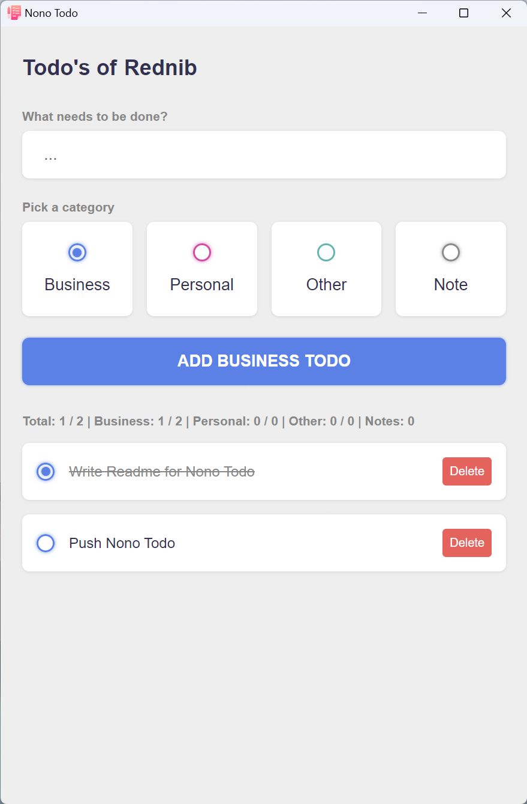

# Nono Todo
A minimal Todo App

# Run
run `npm start`

# Build
[electron-builder](https://www.electron.build/) is used to build the app

run `npm run build`

# Configure the build
Edit the parameters in the `package.json` under `"build"`